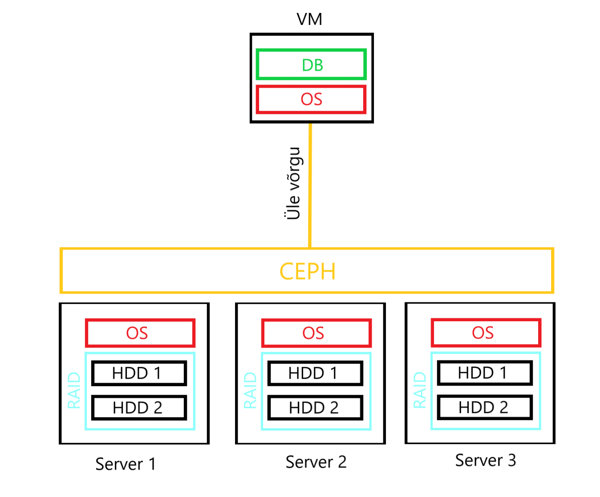
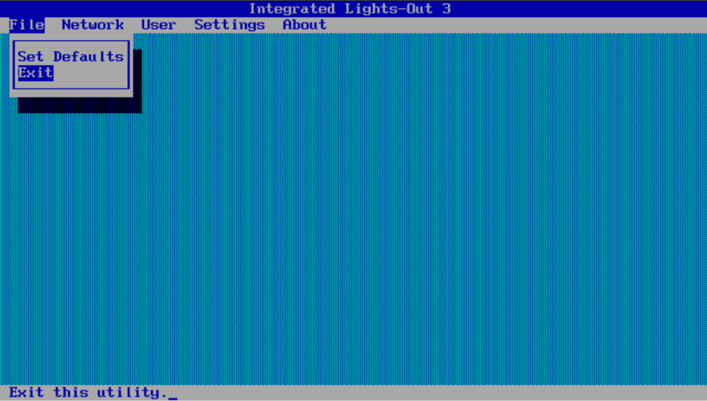
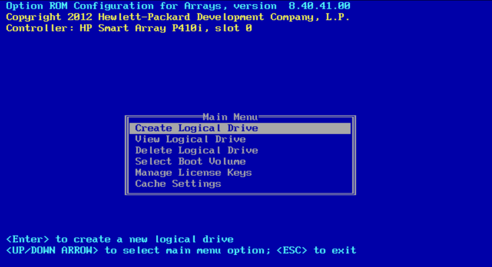
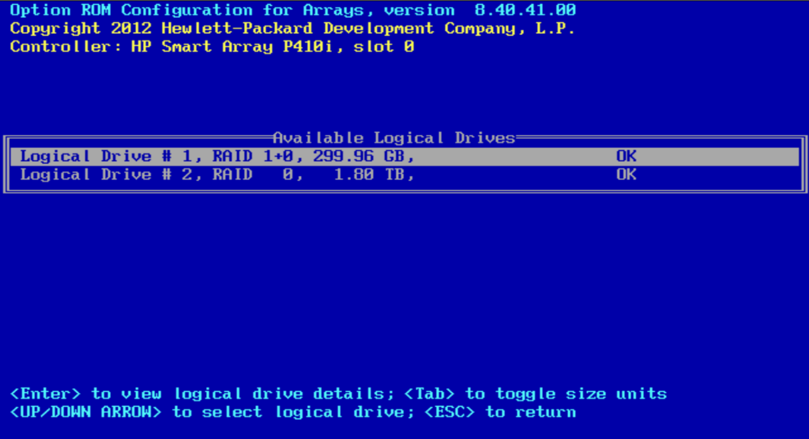

# **Andmesalvestustehnoloogiad - ICA0006**
Autorid (Grupp 11) - Alexander Zelenskiy, Otto Kaur Pappel, Kristjan Steinfeldt, Tõnis Lepp

## **Ülesanne**
1. Kasutades HP serverite ILO kaughaldusliidest seadistada laboris riistvara peale RAID grupp operatsioonisüsteemi jaoks, installida endale sobiv serveri operatsioonisüsteem (3 füüsilist serverit).
2. Serveritele paigaldada horisontaalselt skaleeruv tarkvara (CEPH, ScaleIO, Microsoft Storagespaces, MinIO, Lustre, LizardFS jms).
3. Installeerida terraformi kasutades virtuaalserver ülikooli laborisse.
4. Provisioneerida andmesalvestus pind virtuaalserverile üle IP võrgu (kas plokina, jagatud failisüsteemina või objektide salvestuskohana). Et muuta ülesanne realistlikumaks, panna seda pinda kasutama kas andmebaas või mingi veebirakendus. Veenduda süsteemi tõrkekindluses, lülitades välja suvaline füüsiline server.
<br>

Ülesande lahendamiseks kasutame skeemil näidatud ülesehitust:




## Ülesannete jaotamine
| Ülesanne                                                                             | Vastutav isik       |
|--------------------------------------------------------------------------------------|---------------------|
| [1. RAID seadistamine](#1-raid-seadistamine)                                         | Alexander Zelenskiy |
| [2. OS paigaldamine](#2-os-paigaldamine)                                             | Tõnis Lepp          |
| [3. Andmesalvestuspinna loomine](#3-andmesalvestuspinna-loomine)                     | Kristjan Steinfeldt |
| [4. Virtuaalserveri installeerimine](#4-virtuaalserveri-installeerimine)             | Alexander Zelenskiy |
| [5. Andmesalvestuspinna provisioneerimine](#5-andmesalvestuspinna-provisioneerimine) |                     |
| [6. Andmebaasi seadistamine](#6-andmebaasi-seadistamine)                             | Otto K. P.          |
| [7. Tõrgetestimine](#7-tõrgetestimine)                                               |                     |

## **Ressursid**
| ILO liidese IP-d | Serverite IP-d  | Virtuaalserver  |
|------------------|-----------------|-----------------|
| 192.168.185.7    | 192.168.185.27  | 192.168.180.26  |
| 192.168.185.8    | 192.168.185.28  |                 |
| 192.168.185.9    | 192.168.185.29  |                 |


<br>
VM user: student
<br>
VM password: student1234

## Sisukord

1. [RAID seadistamine](#1-raid-seadistamine)
2. [OS paigaldamine](#2-os-paigaldamine)
3. [Andmesalvestuspinna loomine](#3-andmesalvestuspinna-loomine)
4. [Virtuaalserveri installeerimine](#4-virtuaalserveri-installeerimine)
5. [Andmesalvestuspinna provisioneerimine](#5-andmesalvestuspinna-provisioneerimine)
6. [Andmebaasi seadistamine](#6-andmebaasi-seadistamine)
7. [Tõrgetestimine](#7-tõrgetestimine)

# **1. RAID seadistamine**

Et jõuda RAID konfigureerimise liideseni, tuleb alglaadimise ajal vajutada `F8`.
Eduka sooritamise korral tekib menüü, millest on vaja kohe väljuda:


Pärast akna sulgemist toimub RAID kontrolleri laadimisprotsess, ning avaneb menüü, kus valin `Create Logical Drive`:


Loogilise ketta loomise aknas valin füüsilisi kettaid, mida soovin RAID massiivi panna ning valin sobiva RAID taseme.
Kuna ülesande järgi on vaja saavutada maksimaalse kõrkäideldavuse, valin `RAID 1+0`:


Nüüd on loogiline ketas loodud. Kontrollin seda peamenüü `View Logical Drive` sektsiooni alt:


Kordan seda protsessi kõikide meie grupile antud füüsiliste serverite peal. Protsessi lõpus igale masinale saab seadistatud
üks ketas ~300 GB mahuga.

# **2. OS paigaldamine**

Serveritele installisime operatsioonisüsteemiks Ubuntu server 24.04. Installides sai konfigureeritud serverid vastavatele staatilistele IP'dele. Ubuntu installi eraldi ei dokumenteeri.
Kõikidele serveritele sai loodud kasutaja:

user: student

passwd: student1234

Serveri nimed vastavalt järjekorrale: server1, server2, server3

IP aadress: 192.168.185.2x

Subnet: 255.255.252.0

Gateway: 192.168.187.254

DNS: 172.16.0.175

Serveril on SSH lubatud ja on ligipääsetav kõigile.

# **3. Andmesalvestuspinna loomine**

# **4. Virtuaalserveri installeerimine**

Et kasutada loodud andmesalvestuspinda, loon uue virtuaalmasina ülikooli laborisse, selleks kasutan Hashicorp Terraformi.
Terraform skripti jooksutan MacOS peal, seepärast leian [Terraformi allalaadimisjuhendit MacOS jaoks](https://developer.hashicorp.com/terraform/install?product_intent=terraform).
Jooksutan terminalis järgmised käsud:
```zsh
$ brew tap hashicorp/tap  # Add hashicorp repo to homebrew
$ brew install hashicorp/tap/terraform  # Install terraform using homebrew
```
Terraform saab süsteemile installeeritud. Kontrollin:
```zsh
$ terraform --version

# Output
Terraform v1.11.1
on darwin_arm64
```
Loon oma kodukataloogis uue kausta `~TerraformProjects/ica0006/` ning loon uue faili `main.tf`:
```zsh
$ mkdir -p ~TerraformProjects/ica0006
$ cd TerraformProjects/ica0006
$ touch main.tf
```
Failis [main.tf](files/main.tf) asub terraformi skript, mis loob ülikooli laborisse virtuaalmasina. Enne,
kui seda jooksutada, muudan selles failis `vsphere` provideris `user` ja `password` õigeks, ning samuti
`vsphere_virtual_machine.demo` ressursil muudan grupi numbrit. Nüüd on skript valmis, initsialiseerin terraformi olles
samas kaustas kus asub `main.tf` fail:
```zsh
$ terraform init

# Output
# <output omitted>
Terraform has been successfully initialized!
# <output omitted>

```
Järgmisena käivitan käsu `terraform plan` et kontrollida, et skript töötab nagu oodatud:
```zsh
$ terraform plan

# Output
# <output omitted>
Plan: 1 to add, 0 to change, 0 to destroy.
# <output omitted>
```
Terraform kavatseb luua ühe ressursi, `vsphere_virtual_machine.demo`. Nüüd teen käsu `terraform apply`, et rakendada
konfiguratsiooni:
```zsh
$ terraform apply --auto-approve  # apply config and auto approve

# Output
# <output omitted>
vsphere_virtual_machine.demo: Creating...
vsphere_virtual_machine.demo: Still creating... [10s elapsed]
vsphere_virtual_machine.demo: Still creating... [20s elapsed]
vsphere_virtual_machine.demo: Still creating... [30s elapsed]
vsphere_virtual_machine.demo: Still creating... [40s elapsed]
vsphere_virtual_machine.demo: Still creating... [50s elapsed]
vsphere_virtual_machine.demo: Creation complete after 56s [id=42167a95-ef8c-b846-db0f-f1e56a49a6e3]

Apply complete! Resources: 1 added, 0 changed, 0 destroyed.
```
Kontrollin, kas ressurss on loodud kasutades `terraform state list` käsu:
```zsh
$ terraform state list

# Output
data.vsphere_datacenter.dc
data.vsphere_datastore.datastore
data.vsphere_network.network
data.vsphere_resource_pool.pool
data.vsphere_virtual_machine.template
vsphere_virtual_machine.demo
```
Meid huvitab `vsphere_virtual_machine.demo`, meie loodud VM. Pärin selle ressurssi kohta rohkem infot käsu
`terraform state show vsphere_virtual_machine.demo` abil:
```zsh
$ terraform state show vsphere_virtual_machine.demo

# Output
resource "vsphere_virtual_machine" "demo" {
# <output omitted>
    default_ip_address                      = "192.168.180.26"
# <output omitted>
```
Käsu väljundist meid huvitab virtuaalserveri IP aadress, panen selle [ressurside tabelisse](#ressursid). Kontrollin, kas
server on üles SSH abil:

```zsh
$ ssh student@192.168.180.26
student@192.168.180.26`s password: # student1234

# Output
Welcome to Ubuntu 22.04.3 LTS (GNU/Linux 5.15.0-78-generic x86_64)
# <output omitted>

$ student@lab:~$
```
Kui ligipääs serverile on olemas, võib astuda järgmise sammu juurde.

# **5. Andmesalvestuspinna provisioneerimine**

# **6. Andmebaasi seadistamine**

# **7. Tõrgetestimine**
